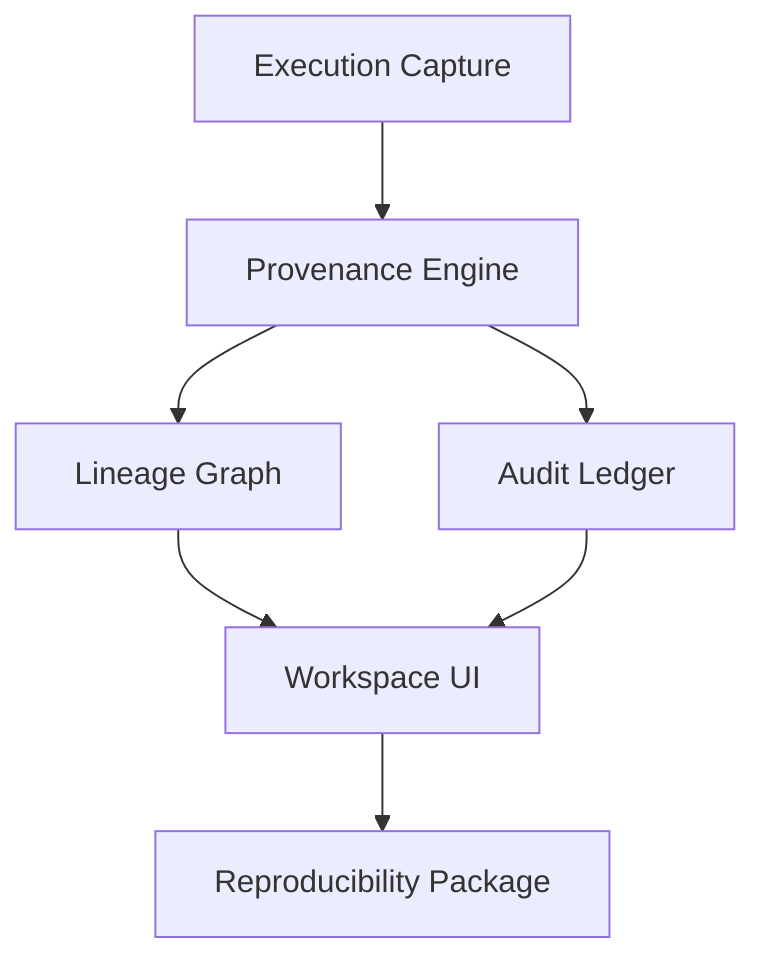
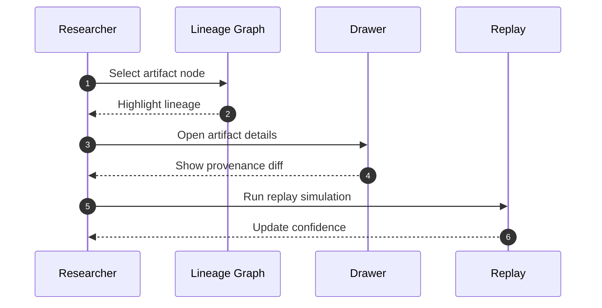

# Provenance OS (Prod)

Release: v1.0.0-prod

Provenance OS is a scientific data reproducibility workspace that captures lineage, environments, and decision history as a live, queryable graph. This production folder contains the deployable static site.

## 1. Platform Architecture

Key workspace capabilities:

- Automatic provenance capture from notebooks and pipelines
- Temporal lineage graph with branching and replay
- Policy-as-code gates and cryptographic audit trail
- Forensic diffing for reproducibility gaps
- Simulation workspace for what-if analysis



## 2. Interaction Workflow



## 3. Project Structure

- data/: lineage graph and incident data
- index.html: site layout and content
- styles.css: design system and layout
- main.js: UI behavior and state
- vercel.json: deployment headers
- lighthouse.json: Lighthouse report snapshot

## 4. Local Validation

1. Static validation

Use VS Code diagnostics or a local static server and verify the console is clean.

2. Optional static server

```powershell
python -m http.server 5173
```

## 5. Deployment

Production is deployed as a static site:

- GitHub repository: https://github.com/PC-User-Guest/Provenance-OS
- Vercel production: https://provenance-os-prod.vercel.app

## 6. Lighthouse

- Store Lighthouse report JSON in lighthouse.json after each release verification.
